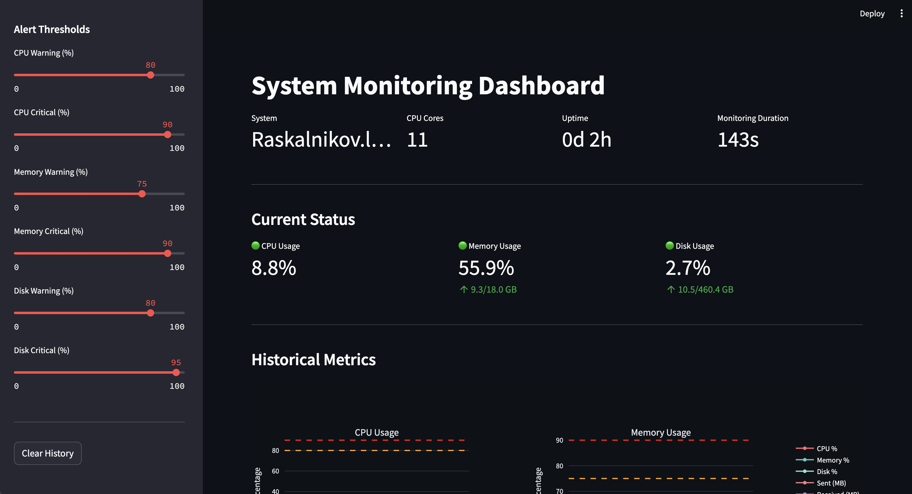

# System Monitoring Dashboard

A real-time system monitoring dashboard built with Python and Streamlit. Monitor CPU, memory, disk usage, and network I/O with configurable alert thresholds and historical visualizations.



## Features

- **Real-time Monitoring**: Live tracking of system metrics with auto-refresh
- **Historical Visualization**: Interactive charts showing metric trends over time
- **Configurable Alerts**: Set custom warning and critical thresholds for each metric
- **Alert Management**: Track and view recent system alerts
- **Clean Interface**: Modern, responsive dashboard built with Streamlit

## Metrics Tracked

- **CPU Usage**: Percentage utilization with per-core details
- **Memory Usage**: RAM utilization and available memory
- **Disk Usage**: Storage capacity and usage statistics
- **Network I/O**: Bytes sent/received and packet counts

## Installation

### Prerequisites

- Python 3.12+

### Setup

1. Clone or download this repository
2. Navigate to the project directory:
   ```bash
   cd system-monitor
   ```

3. Install required dependencies:
   ```bash
   pip install -r requirements.txt
   ```

## Usage

1. Start the dashboard:
   ```bash
   streamlit run app.py
   ```

2. Open your browser and navigate to `http://localhost:8501` to view the dashboard.

## Configuration

Edit `config.yaml` to customize:

- Alert thresholds (warning and critical levels)
- Refresh interval
- History retention settings
- System identification

Example configuration:
```yaml
thresholds:
  cpu_warning: 70
  cpu_critical: 90
  memory_warning: 75
  memory_critical: 90
  disk_warning: 80
  disk_critical: 95
```

## Dashboard Features

### Status Overview
- Current system status with color-coded indicators
- Real-time metric values
- System uptime and monitoring duration

### Historical Charts
- CPU usage trends
- Memory utilization over time
- Disk usage monitoring
- Network I/O visualization

### Alert System
- Automatic threshold checking
- Warning and critical alert levels
- Alert history log
- Real-time notifications

### Settings Panel
- Adjust refresh intervals
- Configure alert thresholds on-the-fly
- Clear monitoring history
- Toggle auto-refresh

## Project Structure

```
system-monitor/
├── app.py                 # Main Streamlit application
├── config.yaml           # Configuration file
├── monitors/
│   └── local_monitor.py  # Local system metrics collector
├── utils/
│   └── alerts.py         # Alert management system
├── requirements.txt      # Python dependencies
└── README.md            # This file
```

## Future Enhancements

- Remote server monitoring via SSH
- Historical data persistence (SQLalchemy/SQLite)
- Email/Slack notifications
- Custom metric plugins like GPU monitoring, temperature sensors, etc.
- Multi-system dashboard view
- Performance baselines and anomaly detection
- Export reports (PDF/CSV)

## Technologies Used

- **Streamlit**: Web application framework
- **psutil**: System metrics collection
- **Plotly**: Interactive visualizations
- **Pandas**: Data manipulation
- **PyYAML**: Configuration management

## License

This project is licensed under the MIT License.

## Author

Built as a portfolio project demonstrating skills in:
- Python development
- System administration
- Data visualization
- Real-time monitoring systems
- Dashboard development
